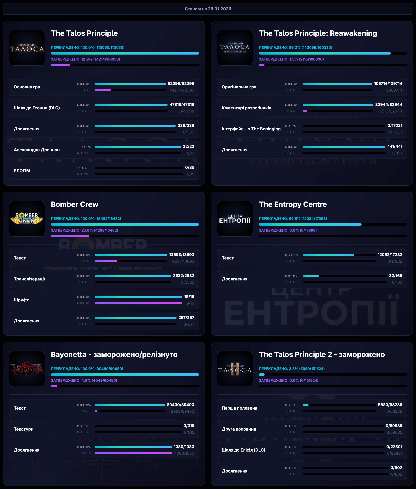
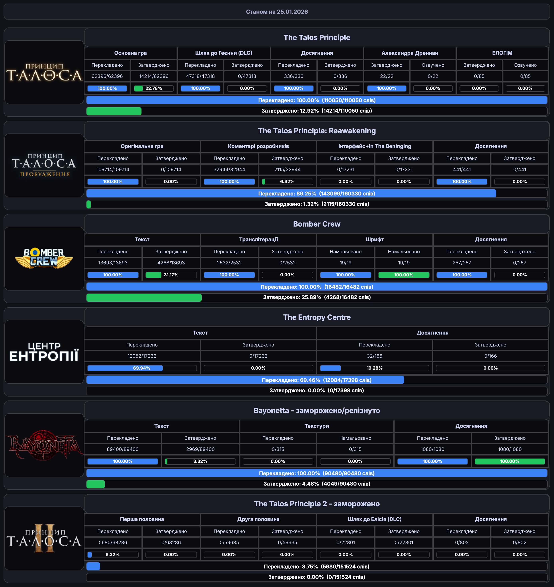
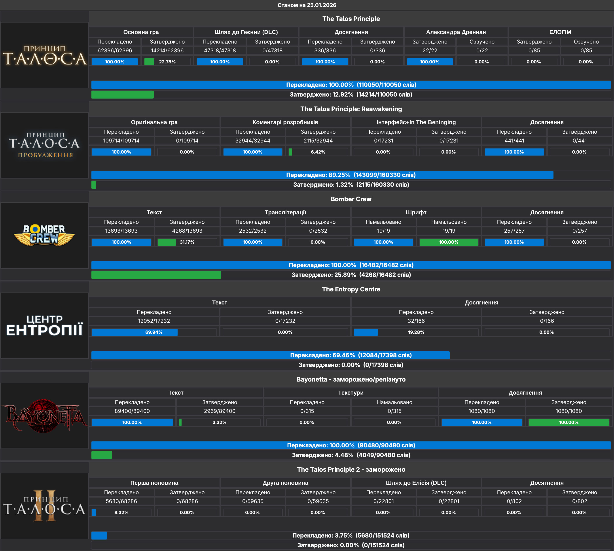

## Візуалізація поступу перекладу спілки "Ліниві ШІ"

# Для особистого використання

* Завантажте сирцевий код собі на пк.
* Встановіть Python з офіційної сторінки.
* Під час інсталяції оберіть: **Додати до PATH**.
* Після, відкриваєм командний рядок.
* Далі вписуємо <code>pip install -r requirements.txt</code>, за відсутності <code>pip</code> пишемо: <code>python install pip</code>.
* Редагуємо <code>data.json</code> у будь-якому комфортному вам текстовому редакторі під свої потреби.
* Опис ключів у <code>data.json</code>:
  * <code>game</code> - назва гри.
  * <code>icon</code> - шлях до будь якого зображення, може бути як у теці <code>icons</code> так і будь-де на пк, головне подати правильне посилання.
  * <code>sections</code> - розділ, що перелічує у собі всі стовпці підгруп перекладу.
    * <code>name</code> - назва підгрупи (текст, DLC, досягнення, текстури, озвучка).
    * <code>translated_label</code> і <code>approved_label</code> - змінні, які дають вам можливість змінити записи <code>Перекладено</code> і <code>Затверджено</code> у підгрупах.
    * <code>total</code> - загальна кількість слів/рядків у підгрупі.
    * <code>translated</code> - перекладена кількість слів/рядків у підгрупі.
    * <code>approved</code> - затверджена кількість слів/рядків у підгрупі.
    * <code>exclude_from_total</code> - якщо має статус <code>true</code> ця підгрупа не буде врахована у загальному підрахунку проєкту.
  
* Відкриваємо командний рядок з теки де пишемо <code>python main.py</code> .
* У відкришимся віконечку відобразиться статистика з файлу <code>data.json</code>, яку можна експортувати у зображення!

<h1 align="center"> <a href="https://t.me/linyvi_sh_ji"><b>Спілка "Ліниві ШІ"</b></a></h1>

