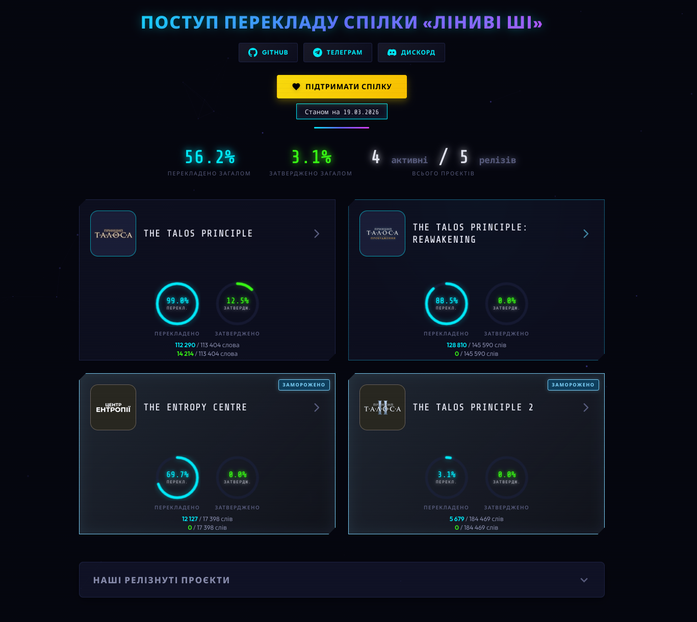

## Візуалізація поступу перекладу спілки "Ліниві ШІ"

Ця програма дозволяє легко керувати даними через зручний редактор та автоматично генерує сучасну веб-сторінку (`index.html`) зі статистикою, яку можна розмістити на GitHub Pages або будь-якому іншому хостингу.

## <h3 align="center"><a href="https://panvena.github.io/progress-visualisation/"><b>Веб-сторінка з поступом</b></a></h3>

##

<p align="center">

</p>

##

<p align="center">
  <b>Візуалізація зображенням</b><br>(Поступів і релізів)<br><br>
  
</p>

<p align="center">
  <b>Візуалізація зображенням (старші)</b><br><br>
  
  
</p>

##


<p align="center">
  <b>Вигляд редакторів</b><br><br>
  
  
</p>

### Основні можливості

*   **Графічний редактор:** Додавайте, редагуйте та видаляйте активні й випущені проєкти прямо в програмі без необхідності вручну правити JSON-файли.
*   **Автоматична генерація:** При кожному збереженні програма сама інтегрує оновлені дані у вашу сторінку `index.html`.
*   **Детальна статистика проєкту:** Розбиття тексту на підгрупи (текст, DLC, досягнення, текстури, озвучка тощо) із можливістю вказувати перекладені та затверджені рядки.
*   **Керування випущеними релізами:** Окрема вкладка для завершених проєктів із керуванням посиланнями для завантаження на різних платформах (Steam, Epic Games, власні сайти тощо).
*   **Легка кастомізація:** Сторінка `index.html` адаптивна, і ви можете змінювати її стилі під власні потреби.

## Для особистого використання

Якщо ви хочете використовувати цю програму для власної команди або проєктів, ось коротка інструкція зі встановлення:

1.  **Завантажте** сирцевий код собі на ПК (нажміть *Code -> Download ZIP* або зробіть форк репозиторію).
2.  **Встановіть Python** з [офіційної сторінки](https://www.python.org/downloads/).
    *   *Важливо:* Під час інсталяції обов'язково поставте галочку біля **Add Python to PATH**.
3.  Відкрийте командний рядок (Terminal / CMD) у теці з програмою.
4.  Встановіть усі необхідні залежності:
    ```bash
    pip install -r requirements.txt
    ```
    *(Якщо виникає помилка з `pip`, можна спробувати: `python -m pip install -r requirements.txt`)*
5.  Запустіть програму:
    ```bash
    python main.py
    ```
    **Для користувачів Windows:** замість використання консолі ви можете просто двічі клікнути на файл **`start.bat`**, щоб запустити програму.

    *(Примітка для користувачів Windows: перший рядок файлу `main.py` (`#!/usr/bin/env python3`) призначений для Linux/macOS. Якщо ви запускаєте `main.py` вручну через консоль і виникає помилка — просто видаліть його.)*

### Як це працює?

*   Програма зберігає всі ваші налаштування та проєкти у файлі <code>data.json</code>. Хоча ви можете редагувати його вручну, зручніше та безпечніше робити це через графічний інтерфейс програми.
*   Після збереження змін згенеровані дані автоматично потрапляють у `index.html`. Для цього програма шукає спеціальні коментарі в `index.html` (між якими лежить масив `EMBEDDED_DATA`), і перезаписує їх новими даними.
*   Нові зображення для іконок ігор ви можете закидати у теку <code>icons</code> і потім просто обирати відповідний файл чи вказувати шлях через застосунок.

## Як безкоштовно розмістити сторінку на GitHub Pages

Найпростіший спосіб швидко створити свій сайт зі статистикою — зробити форк цього репозиторію і використати безкоштовний сервіс GitHub Pages. Ось як це зробити:

1. Зробіть **Fork** (форк) цього репозиторію на свій GitHub акаунт (кнопка *Fork* у правому верхньому куті сторінки).
2. Перейдіть до налаштувань **вашого** створеного репозиторію — вкладка **Settings** (⚙️).
3. У лівому меню (в секції *Code and automation*) натисніть на **Pages**.
4. У розділі **Build and deployment**:
   * Для **Source** оберіть `Deploy from a branch`.
   * Для **Branch** вкажіть вашу основну гілку (зазвичай `main`), залиште шлях `/(root)` і натисніть **Save**.
5. Зачекайте 1-2 хвилини. Зверху в налаштуваннях з'явиться посилання на ваш опублікований інтернет-сайт!

> **Порада:** Щойно ви внесете нові зміни через програму, просто завантажуйте оновлені `index.html`, `data.json` (та нові картинки, якщо є) назад у свій форк на GitHub, і сторінка автоматично оновиться для всіх відвідувачів.

---
<h3 align="center">Розробник: <a href="https://t.me/linyvi_sh_ji"><b>Спілка "Ліниві ШІ"</b></a></h3>

<p align="center">
  Цей проєкт поширюється на умовах відкритої <a href="LICENSE">ліцензії MIT</a>.
</p>
